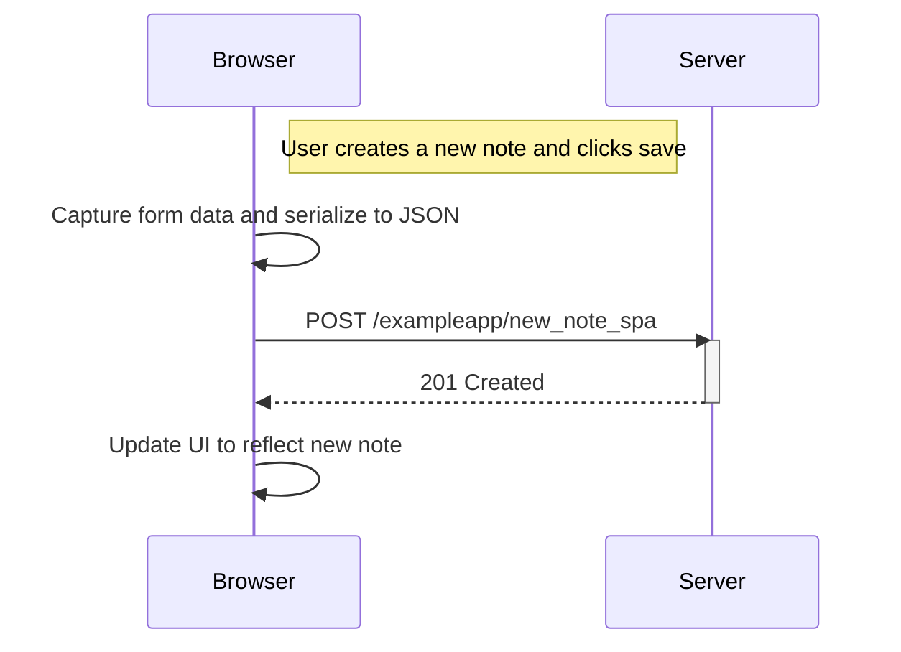

```mermaid
sequenceDiagram
    participant Browser
    participant Server

    Note right of Browser: User creates a new note and clicks save

    Browser->>Browser: Capture form data and serialize to JSON
    Browser->>Server: POST /exampleapp/new_note_spa
    activate Server
    Server-->>Browser: 201 Created
    deactivate Server

    Browser->>Browser: Update UI to reflect new note

```
